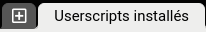
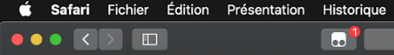
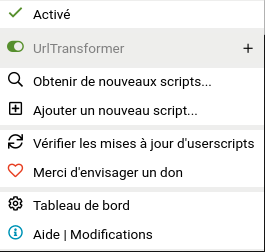
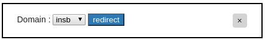

# UrlTransformerScript

Ce script permet de rediriger la page visité vers la version disponible après connexion

## Prérequis

- Utiliser le navigateur de son choix
- Télécharger Tampermonkey (gratuit sur Edge, Chrome et Firefox, environ 2.5€ sur Safari), l'ensemble des liens de téléchargement sont présent le [site officiel](https://www.tampermonkey.net/index.php?ext=dhdg)

## Installation

1 - Lancer l'extension  
2 - Ajouter le contenu du fichier `index.js` à l'extension, pour cela cliquer sur le +  
  
3 - Désactiver l'extension (Doit être comme l'image)  
  

## Utilisation

1 - Se rendre sur le site que l'on veut  
2 - Activer l'extension en cliquant sur le logo de tampermonkey et en décochant `UrlTransormer` 
  
  
3 - Actualiser la page  
4 - Une popup doit apparaitre au milieu de la page  
  
5 - Choisir son domaine et cliquer sur le bouton `redirect` pour être redirigé vers la version disponible de cette page  
6 - Désactiver l'extension (pour ne pas avoir la popup qui apparait à chaque page visitée)  
